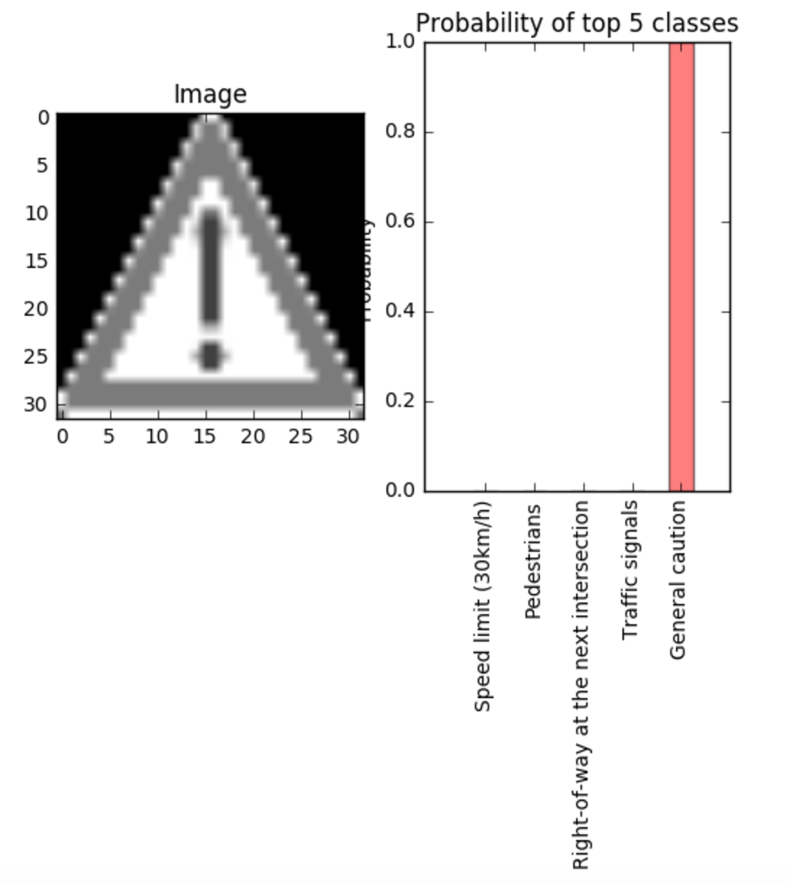
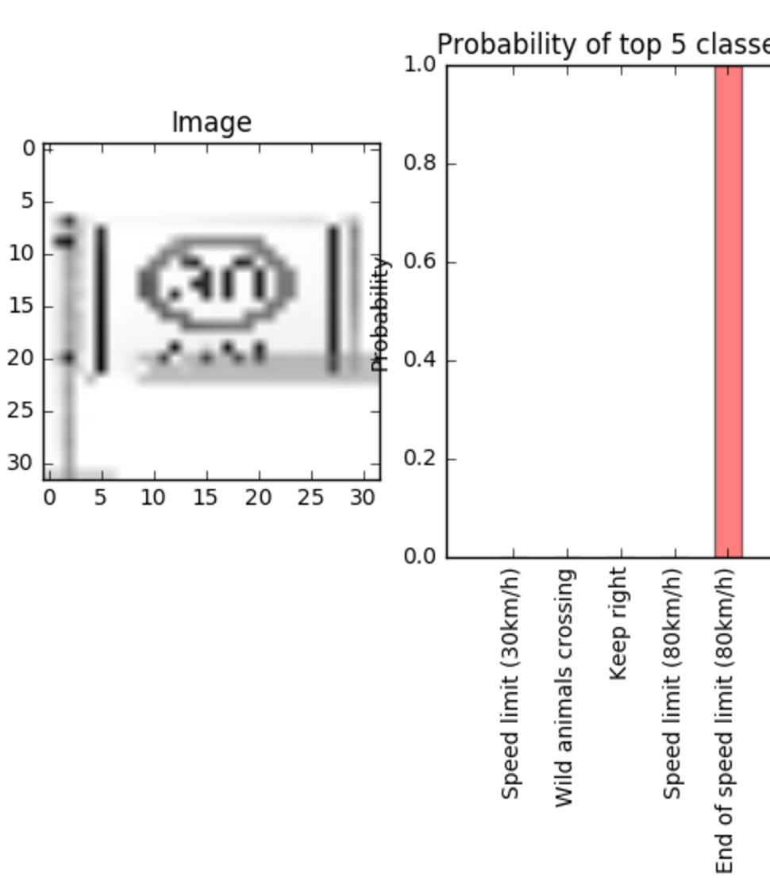

The second project in the [Self Driving Car Nano-degree](https://www.udacity.com/course/self-driving-car-engineer-nanodegree--nd013) was the application of deep learning to the problem of traffic sign classification. Identifying traffic signs correctly and taking appropriate action is crucial to the operation of an autonomous vehicle.

The project was markedly more difficult than the previous one of lane detection for several reasons including the steep learning curve of the [Tensorflow](https://www.tensorflow.org/) deep learning framework, the vast number of hyper-parameters that deep learning models have to tune and the extremely slow turn around time for model validation on CPUs which necessitates the setup of an environment with a powerful GPU either physically or using a cloud provider.

We were provided with the [German Traffic Signs](http://benchmark.ini.rub.de/?section=gtsrb&subsection=dataset#Downloads) data set that contained about 40k training examples and 12k testing examples. The problem was one of classification which aims to assign the right class to a new image of a traffic sign by training on the provided pairs of traffic sign images and their labels. The project was broken down into:

### 1. Exploratory Data Analysis
The provided training data was examined mainly for the distribution of the various classes. The classes were found to be highly imbalanced indicating the need for data generation for the under-represented classes.

### 2. Data Pre-processing and Augmentation
The input images to the neural network went through a few pre-processing steps to help the gradient descent optimization for training the network. Pre-processing included:

i.  **Grey Scale Conversion**

ii. **Centering of images** : The mean pixel value was subtracted from each pixel of the image to center the data around the origin

iii. **Normalization** : This was done by dividing each dimension by its standard deviation once it was zero-centered. This is not strictly needed for images because the relative scales of pixels are already approximately equal. This process causes each feature to have a similar range so that our gradients don't go out of control (and that we only need one global learning rate multiplier).

Additional data for under-represented classes was generated through a combination of the following techniques:

-  **Translation**

-  **Rotation**

- **Affine transformations**

### 3. Definition of CNN Architecture

Fig: CNN Architecture

The model consisted of 2 convolutional layers followed by two fully connected layers. Several methods were employed for preventing over-fitting including:

-   **Max Pooling**

-  **Drop Outs**

- **L2 Regularization**

-  **Validation Data set**

### 4. Training the model

Training on a CPU became quickly unwieldy and frustrating, so I set up an environment in AWS by following the instructions [here](http://max-likelihood.com/2016/06/18/aws-tensorflow-setup/). Additionally, to set up jupyter on AWS and run Jupyter Notebooks remotely, I followed the instructions [here](https://gist.github.com/iamatypeofwalrus/5183133). The model was trained for around 100 epochs resulting in validation accuracy of 99.7% and a test accuracy of 96.2%.

### 5. Testing on real world examples

The model was tested on images from the web and the probabilities of the top 5 predicted classes were plotted. For some of the classes the model was spot on:

Fig: Classification of New Image

The model classifier mis-classified some images, but had the correct prediction within the top 5 predicted classes. For example, this 30km/h sign was mis-classified as an 80km/h sign:

Fig: Mis-classification of 30km/h sign

Overall, this project was a great learning experience. However, there does still exist several areas for improvement. The project in it's current state can he found [here](https://github.com/Deborah-Digges/SDC-ND/blob/master/P2-traffic-signs/Traffic_Signs_Recognition.ipynb).
